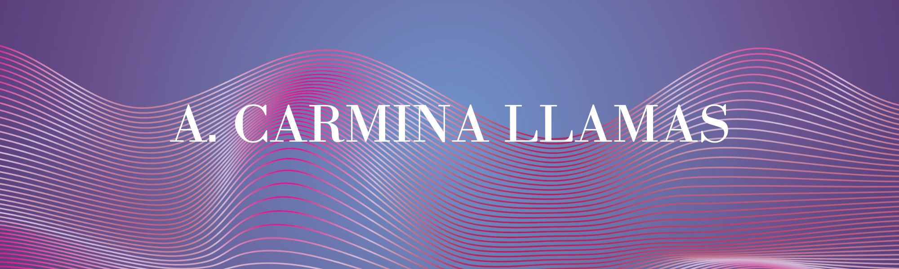

### Hola, soy Carmina 👋

## Sobre mí

Soy un estudiante, apasionado por la tecnología. Me encanta los videojuegos, ver anime, aprender y nadar.

- 🔭 Actualmente soy estudiante en la Universidad Autónoma de Zacatecas.
- 🌱 Estoy aprendiendo HTML5 y CSS3
- 💬 Pregúntame sobre One Piece

  
  
  
- 📫 Cómo contactarme: llamasvlzcarmina@gmail.com
- 😄 Pronombres: ella

---

## Proyectos  :toolbox:

- Clon de la Interfaz de [Pinterest](https://github.com/ACarminaLlamas/pinterestinterfaz) :pirate_flag::

  Se realizó como práctica de mis estudios de HTML5 y CSS3. Cuenta con una interfaz responsiva y un diseño lindo.

- Construyendo :bricks:

---

## Lenguajes y herramientas
   

---

<!--
**ACarminaLlamas/ACarminaLlamas** is a ✨ _special_ ✨ repository because its `README.md` (this file) appears on your GitHub profile.

Here are some ideas to get you started:

- 🔭 I’m currently working on ...
- 🌱 I’m currently learning ...
- 👯 I’m looking to collaborate on ...
- 🤔 I’m looking for help with ...
- 💬 Ask me about ...
- 📫 How to reach me: ...
- 😄 Pronouns: ...
- ⚡ Fun fact: ...
-->
